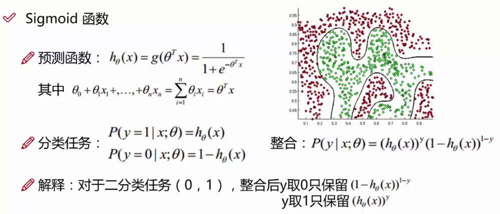

# AILab
ai学习lab，一些实践样例留存

==============================STUDY=============================

# 算法

## 线性回归

> 例子：
>
> 数据：工资和年龄（2个特征）
>
> 目标：预测能贷款多少（标签）
>
> 考虑：工资和年龄如何影响贷款数额
>
> 机器学习目的：找到一条线来最好的拟合我们的数据样例

> 回归和分类  --> 有监督的机器学习

> 额外的增加一列 x0  用于公式转换 x0值都为1而已

真实值和预测值肯定存在误差，每个误差都不一样（各自独立）

**误差 与 回归函数 推演 似然函数与求解**

> 似然函数：由数据去推算参数。要让参数接近真实值，那就要让似然函数取最大值，也叫极大似然函数

**评估方法**

> 评估模型好不好（公式好不好，得出来的参数值）

## 梯度下降

> 引入：得到一个目标函数后如何求解？直接求解不一定可解，线性回归只是个特例
>
> 常规套路：机器学习的套路就是我交给机器一堆数据，然后告诉他什么样的学习方式是对的（目标函数），然后让它朝着这个方向去做
>
> 如何优化：一步一步迭代，每次优化一点点

## 逻辑回归

> 二分类算法

> 目的：分类
>
> 机器学习算法选择：先逻辑回归再用复杂的，能简单就不复杂
>
> 逻辑回归的决策边界：可以是非线性的

